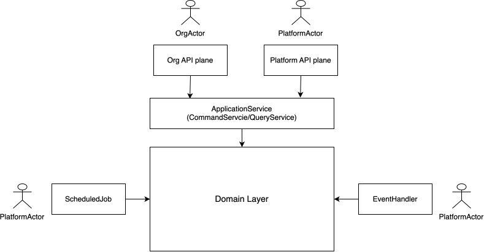

# Explicitly pass through actor context

## Context

In software, the "Current User Context" refers to the information about the user who is currently interacting with the
system. This context typically includes details such as the user's identity, roles, permissions, and other relevant
attributes. It helps the system understand who the user is and what they are allowed to do, enabling personalized
experiences and enforcing security measures.

In multithreaded applications, when retrieving the current user context, there are two common approaches:

- Store the user context in a ThreadLocal variable, such as Spring Security's `SecurityContextHolder`. This has the
  advantage of being easily accessible from anywhere in the code without needing to pass it explicitly. However, it
  makes the code implicit and hence increase the cognitive load of the code, also it makes testing harder.
- Pass the user context explicitly as a parameter down to all layers. This approach is more explicit and makes it clear
  where the user context is being used, but it requires more boilerplate code to pass the context through multiple
  layers.

## Decision

We choose to explicitly pass through the user context as a parameter, as we prefer explicitness to implicitness. We
believe the boilerplate code will not cost much development time as developers spend most of their time on
designing/thinking/understanding/debugging rather than typing.




## Implementation

[Actor](../src/main/java/com/company/andy/common/model/actor/Actor.java) is used to represent the user context. Is has
two concrete subclasses:

- `OrgActor`: represents an organization actor, it always carries an `orgId`;
- `PlatformActor`: represents an non-organization actor;

As a general programming rule, your code should use the base class `Actor` as much as possible, this often happens in
your AggregateRoots, DomainServices and DomainEvents.

You should use the more specific types only when you need specific data from the actor (e.g. get `orgId` from
`OrgActor`). This often happens in Controllers, EventHandlers, CommandServices and QueryServices etc.

Normally you don't need to create these actor object by yourself, the framework already creates them for you. For
example:

- In Spring MVC controllers, the actor object is created by Spring Security, you can declare your controller method with
  `@AuthenticationPrincipal` to get the actor object:

```java
    public ResponseId createEquipment(@RequestBody @Valid CreateEquipmentCommand command, @AuthenticationPrincipal @NotNull OrgActor actor) {
        return new ResponseId(this.equipmentCommandService.createEquipment(command, actor));
    }
```

- In event handlers, a `PlatformActor` object is created by the framework and passed to the `handle()` method which you
  will implement. For example:

```java
    @Override
    protected void handle(EquipmentCreatedEvent event, PlatformActor actor) {
        log.info("{} called for Equipment[{}].", this.getClass().getSimpleName(), event.getArId());
    }
```

### Two API planes

In multitenant applications, normally there are two API planes:

- The **org API plane** for manipulating org level resources, requires an `OrgActor` to access with the following cases:
    - An org member
    - An org service client
    - An supervisor acting as an `OrgActor` for a specific org
    - A platform service client acting as an `OrgActor` for a specific org
- The **platform API plane** for manipulating platform level resources, requires a `PlatformActor` to access with the
  following cases:
    - A supervisor
    - A platform service client
