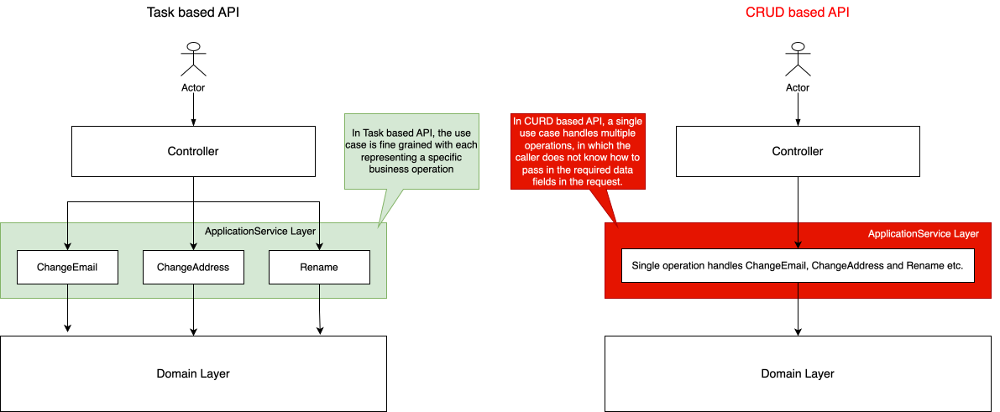

# Use Task based API

## Context

When implementing APIs, there are mainly two approaches:

- **Task based API**: The API is designed to perform a specific task, which may involve multiple steps or operations.
  The API endpoint represents a single action or command that the client wants to execute. This approach focuses on the
  business intent of the operation rather than just data manipulation.
- **CRUD based API**: The API is designed around the basic Create, Read, Update, and Delete operations for the whole
  resource as a single entity. It can be quite easy to start with but in the long run it can be hard to maintain and
  extend, especially when the business logic is complex.

## Decision

We choose **Task based API** over **CRUD based API**, as **Task based API** provides the following advantages:

- Clearer business intent: Each API endpoint represents a specific task or action, making it easier for clients to
  understand the purpose of the API and how to use it.
- Separation of concerns: By focusing on specific tasks, the API can be designed to handle different aspects of the
  business logic independently, making it easier to maintain and extend.



## Implementation

"Create" and "Update" are the most common scenarios where Task base API is used.

Example
in [EquipmentController](../src/main/java/com/company/andy/feature/equipment/controller/EquipmentController.java):

For updating equipment name and holder name, instead of creating just one endpoint to cover both, two separate endpoints
are created, namely `updateEquipmentName()` and
`updateEquipmentHolder()`, each representing a specific task.

```java

    @Operation(summary = "Update an equipment's name")
    @PutMapping("/{id}/name")
    public void updateEquipmentName(
            @PathVariable("id") @NotBlank
            @Parameter(description = "Id of the equipment")
            String equipmentId,
            @RequestBody @Valid UpdateEquipmentNameCommand command,
            @AuthenticationPrincipal @NotNull OrgActor actor) {
        this.equipmentCommandService.updateEquipmentName(equipmentId, command, actor);
    }

    @Operation(summary = "Update an equipment's holder")
    @PutMapping("/{id}/holder")
    public void updateEquipmentHolder(
            @PathVariable("id") @NotBlank String equipmentId,
            @RequestBody @Valid UpdateEquipmentHolderCommand command,
            @AuthenticationPrincipal @NotNull OrgActor actor) {
        this.equipmentCommandService.updateEquipmentHolder(equipmentId, command, actor);
    }
```

## More read

- https://blog.mithril.be/posts/task-based-vs-crud-based-in-api/