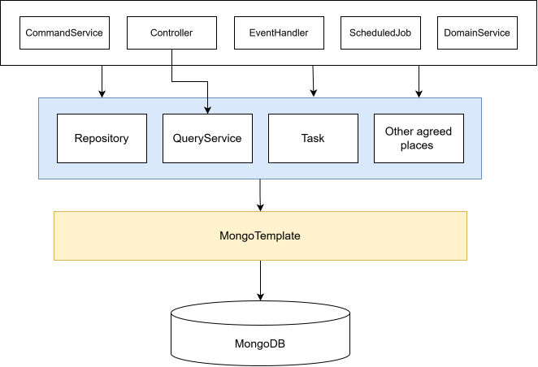

# Database Access Strategy

## Context

Database is in the center of all enterprise applications. It is important to have a clear strategy on how to access the
database in a consistent and maintainable way.

## Decision

We treat database as just an implementation detail which our own business code should be decoupled from. Access to
database should not be exposed everywhere in the code but via some abstraction layers.

## Implementation

- `MongoTemplate` is the lowest level entrypoint for access MongoDB. The below are the most common places where
  `MongoTemplate` is used:
    - **Repository**: for persisting and retrieving AggregateRoot,
      example: [EquipmentRepository.existsByName()](../src/main/java/com/company/andy/feature/equipment/domain/EquipmentRepository.java)
    - **QueryService**: for querying data from database directly in [CQRS](./004_use_lightweight_cqrs.md) pattern,
      example: [EquipmentQueryService.pageEquipments()](../src/main/java/com/company/andy/feature/equipment/query/EquipmentQueryService.java)
    - **Task**: for background tasks that need to access database,
      example: [CountMaintenanceRecordsForEquipmentTask](../src/main/java/com/company/andy/feature/equipment/domain/task/CountMaintenanceRecordsForEquipmentTask.java)
    - **ScheduledJob**: for scheduled jobs that need to access database,
      example: [DomainEventHouseKeepingScheduledJob](../src/main/java/com/company/andy/common/event/DomainEventHouseKeepingScheduledJob.java),
      prefer using `Repository` and `Task` instead.
- All other places other than the above should not use `MongoTemplate` directly unless agreed by the team.
